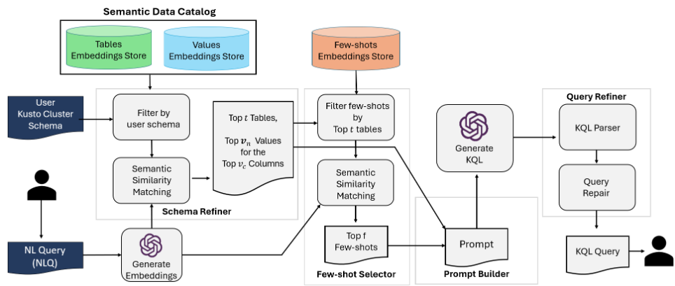

# NL2KQL: From Natural Language to Kusto Query

The repository of paper ["NL2KQL: From Natural Language to Kusto Query"](https://arxiv.org/pdf/2404.02933).

If you use the NL2KQL code, data, or results, please cite the following reference:

```bibtex
@article{tang2025nl2kqlnaturallanguagekusto,
  title={NL2KQL: From Natural Language to Kusto Query},
  author={Xinye Tang and Amir H. Abdi and Jeremias Eichelbaum and Mahan Das and Alex Klein and Nihal Irmak Pakis and William Blum and Daniel L Mace and Tanvi Raja and Namrata Padmanabhan and Ye Xing},
  journal={arXiv preprint arXiv:2404.02933},
  year={2025}
}
```

## NL2KQL


## Datasets

1. **Schema**
The schema is provided as a JSON file that defines the structure of the Kusto database. 
2. **Semantic Data Catalog**
The semantic data catalog is provided as a YAML file, enriched with annotations to facilitate natural language understanding.
3. **Evaluation Datasets**
The evaluation datasets contain NLQ-KQL pairs that were drafted by domain experts for two distinct Kusto databases, each with unique schemas:
- **Sentinel**: [microsoft-sentinel](https://azure.microsoft.com/en-us/products/microsoft-sentinel)
- **Defender**: [microsoft-defender](https://www.microsoft.com/en-us/security/business/microsoft-defender)


## Safe and responsible use 
This research project leverages advanced Large Language Models (LLMs) to provide sophisticated natural language processing capabilities to generate KQL queries. As powerful as these tools are, it is crucial to use them in a manner that is both safe and responsible. The method is intended to use the GPT-4 model from OpenAI, either via the OpenAI or Azure OpenAI APIs. See the [GPT-4 System Card](https://cdn.openai.com/papers/gpt-4-system-card.pdf) to understand the capabilities and limitations of this model. 

## Disclaimer
The purpose of this research project is solely focused on translating natural language queries into Kusto Query Language (KQL) queries. The data released here is intended strictly for research purposes related to the text-to-KQL task and is not authorized for any other use.

## Contributing
This project welcomes contributions and suggestions.  Most contributions require you to agree to a Contributor License Agreement (CLA) declaring that you have the right to, and actually do, grant us the rights to use your contribution. For details, visit https://cla.opensource.microsoft.com. When you submit a pull request, a CLA bot will automatically determine whether you need to provide a CLA and decorate the PR appropriately (e.g., status check, comment). Simply follow the instructions provided by the bot. You will only need to do this once across all repos using our CLA.

This project has adopted the [Microsoft Open Source Code of Conduct](https://opensource.microsoft.com/codeofconduct/). For more information see the [Code of Conduct FAQ](https://opensource.microsoft.com/codeofconduct/faq/) or contact [opencode@microsoft.com](mailto:opencode@microsoft.com) with any additional questions or comments.

## Pricacy
See [Microsoft Privacy Statement](https://www.microsoft.com/en-us/privacy/privacystatement)

## Trademarks
This project may contain trademarks or logos for projects, products, or services. Authorized use of Microsoft trademarks or logos is subject to and must follow [Microsoft's Trademark & Brand Guidelines](https://www.microsoft.com/en-us/legal/intellectualproperty/trademarks/usage/general). Use of Microsoft trademarks or logos in modified versions of this project must not cause confusion or imply Microsoft sponsorship. Any use of third-party trademarks or logos are subject to those third-party's policies.

## License
See [LICENSE](./LICENSE)